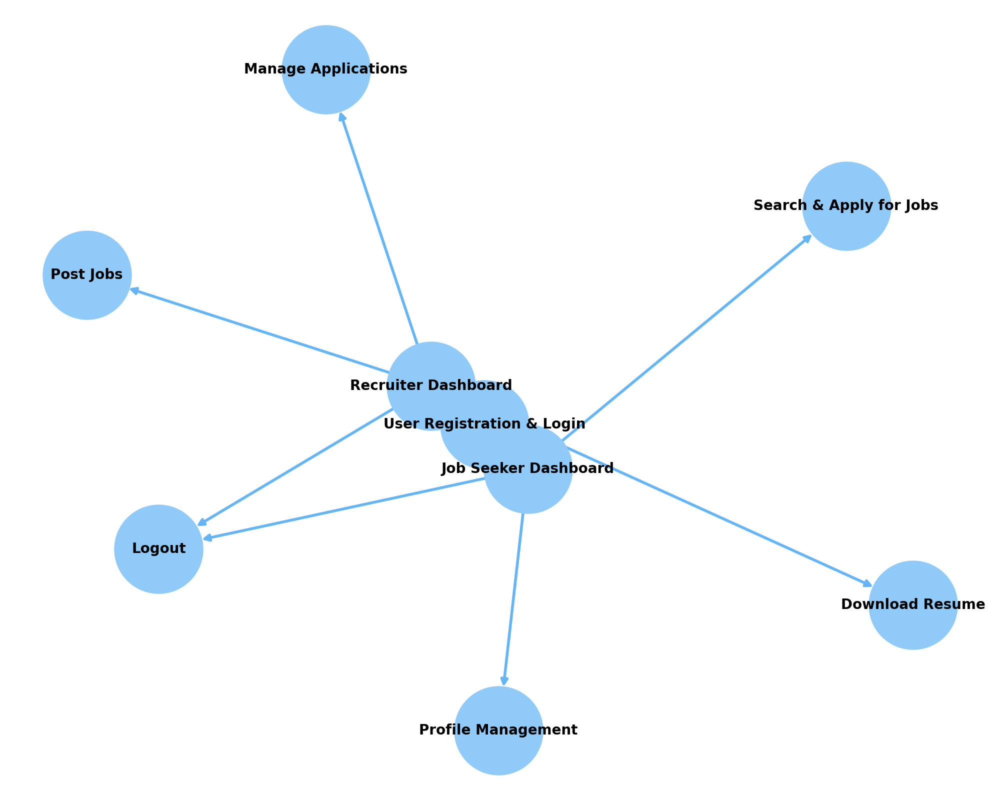

# job-portal-web-application - findAJob.com
**findAJob.com** is a comprehensive job portal application developed using **Spring Boot 3**, **Spring MVC**, **Thymeleaf**, **Spring Security**, and **Hibernate/JPA**. It serves as a platform for recruiters to post job opportunities and job seekers to search and apply for jobs. The application is built with a user-friendly interface and follows industry best practices in software development.

---

## 🚀 Features

- **User Authentication and Authorization:** Secure login, logout, and registration using Spring Security.
- **Role Management:** Separate dashboards for recruiters and job seekers.
- **Job Management:** Recruiters can create, edit, and delete job postings.
- **Job Application:** Job seekers can search and apply for jobs.
- **Profile Management:** Users can manage their profiles and upload resumes.
- **File Upload and Download:** Recruiters can download applicants' resumes.
- **Global Search:** Search for jobs using keywords.

---

## 🛠️ Technologies Used

- **Spring Boot 3.4**
- **Spring MVC**
- **Spring Security**
- **Spring Data JPA**
- **Hibernate 6**
- **MySQL**
- **Thymeleaf**
- **Bootstrap & jQuery**
- **Maven**
- **IntelliJ IDEA/ Spring Tool Suite IDE**

---

## 📦 Project Structure

```
findAJob/
├── src/
│   ├── main/
│   │   ├── java/
│   │   │   ├── com.jobportal/
│   │   │   │   ├── controller/
│   │   │   │   ├── model/
│   │   │   │   ├── repository/
│   │   │   │   ├── service/
│   │   │   │   └── config/
│   │   ├── resources/
│   │   │   ├── templates/
│   │   │   ├── static/
│   │   │   └── application.properties
└── pom.xml
```

---

## 🧑‍💻 Authors

- **Ram Mohan Reddy Seelam** *(Developer)* - Designed and implemented the backend architecture, handled data management using Hibernate, and ensured secure authentication using Spring Security.

### Special Thanks
- **Chád Darby** and **Ravi Singh** *(Instructors from Luv2Code)* - Provided comprehensive guidance and resources for the course project.

---

## 🛡️ Security Features

- **Password Encryption:** Uses Bcrypt for password hashing.
- **Role-Based Access:** Controlled access with recruiter and candidate roles.
- **Session Management:** Secure management of user sessions.

---

## 📖 Design and Flow

### 📊 **Application Flow**



1. **User Registration and Login:**
    - Users register and choose their role (Recruiter or Job Seeker).
    - Secure authentication using Spring Security.
2. **Role-Specific Dashboard:**
    - **Recruiter Dashboard:**
        - Post new jobs.
        - View and manage job applications.
        - Download applicant resumes.
    - **Job Seeker Dashboard:**
        - Search and apply for jobs.
        - Track application status.
        - Manage profile and upload resume.
3. **Job Management:**
    - Jobs are created using recruiter input and stored in MySQL using Hibernate.
    - Job seekers can browse jobs using keywords and filters.
4. **Application Management:**
    - Applicants' data is saved using the **JobSeekerApply** entity.
    - Recruiters can see application details via **JobPostActivity**.
5. **File Management:**
    - Job seekers upload resumes.
    - Recruiters download resumes using Spring Boot file handling.

### 🧱 **Architecture Overview**

```
[Web Browser] → [Spring MVC Controller] → [Service Layer] → [Repository Layer] → [MySQL Database]
```

- **Controller:** Handles HTTP requests and processes them using services.
- **Service Layer:** Contains business logic and interacts with repositories.
- **Repository:** Handles data persistence using JPA and Hibernate.
- **View Layer:** Thymeleaf templates render dynamic HTML content.

---


## 🧪 Testing

- Perform unit testing using **JUnit** and **Mockito**.
- API testing can be done using **Postman**. Collection files are provided in the `test/resources` folder.

---

## 📌 Future Enhancements

- Implement job recommendations using AI.
- Add notifications for job updates and application status changes.
- Enable advanced search with filters for job location, salary, and type.

---

## 💬 Contact

For any queries, feel free to reach out to **Ram Mohan Reddy Seelam** at [LinkedIn](https://www.linkedin.com/in/rammohanreddy-s/) or open an issue in the repository.

---